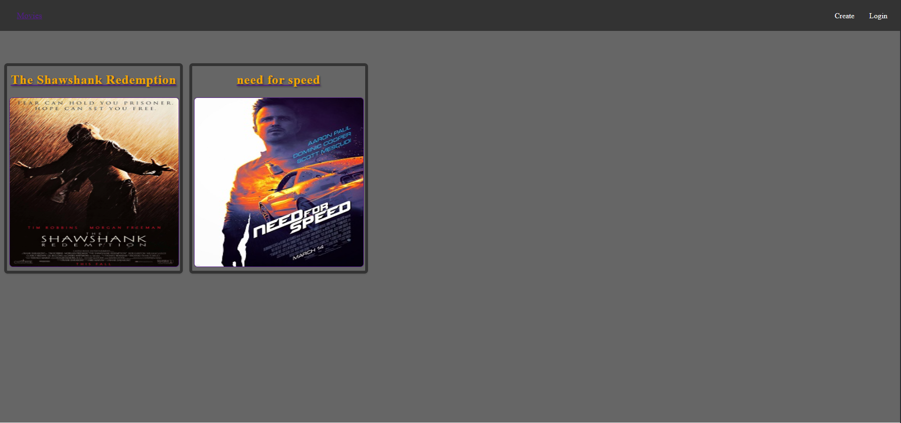
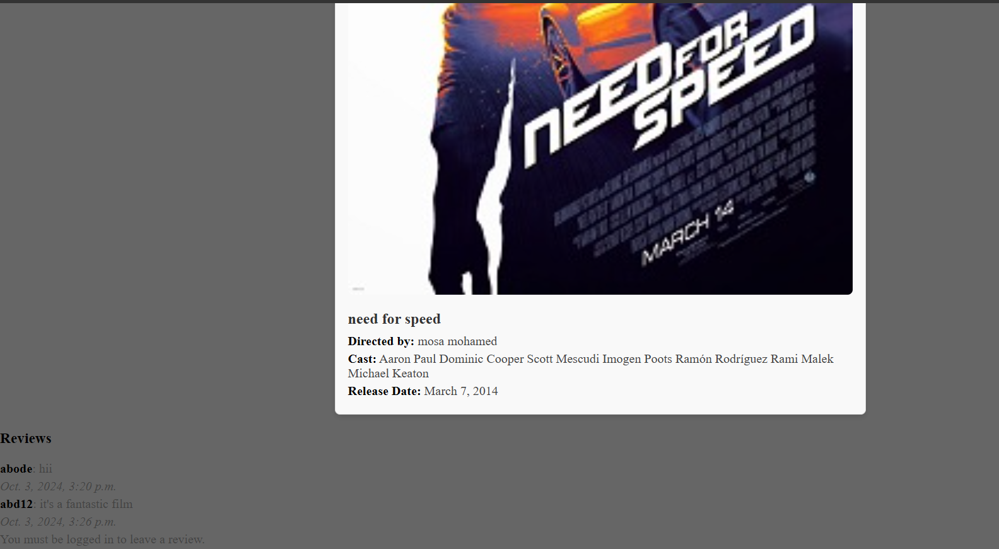

### How to Run the Project

Follow these steps to set up and run the project locally:

#### 1. Clone the Repository
Open a terminal and run the following command to clone the repository:
git clone https://github.com/AbdullahAboElHija/MoviesIMDB.git

cd MoviesIMDB
# you can run or from the docker like this : 
#### 1.1 open the terminal

#### 1.2 build and run docker compose 
docker compose up --build

# the second way to run it :
#### 1.1 Create a Virtual Environment
It's recommended to use a virtual environment for managing dependencies. Run the following command to create one:
python3 -m venv venv

#### 1.2 Activate the Virtual Environment
venv\Scripts\activate

#### 1.3 Install the Dependencies
Once the virtual environment is activated, install the required packages by running:
pip install -r requirements.txt

#### 1.4 Apply Migrations
Run Django migrations to set up the database:
python manage.py migrate

#### 1.5 Run the Development Server
Start the Django development server:
python manage.py runserver

#### 1.6 Access the Application
Once the server is running, open your web browser and go to:
http://127.0.0.1:8000/

### Main Screen

### Details Screen (reviews on film)

